# LeafDetect1
An Android app that facilitates farmers, scientists, botanists to detect the type of crop, pests, and other kind of diseases in them, The app sends the image of the plant to the server where it is analyzed using machine learning. Once detected, the disease and its solutions are displayed to the user.

# Introduction

Since, disease detection in plants plays an important role in the agriculture field, as having a disease in plants is quite natural. If proper care is not taken in this area then it can cause serious effects on plants and due to which respective product quality, quantity or productivity is also affected.

Automatic detection of plant diseases is an important research topic as it may prove benefits in monitoring large fields of crops, and at a very early stage itself it detects the symptoms of diseases means when they appear on plant leaves.

This enables machine vision that is to provide image-based automatic inspection, process control. Comparatively, visual identification is labor intensive less accurate and can be done only in small areas. The project involves the use of self-designed image processing algorithms and techniques designed using python to segment the disease from the leaf while using the concepts of machine learning to categorize the plant leaves as healthy or infected. By this method, the plant diseases can be identified at the initial stage itself and the pest and infection control tools can be used to solve pest problems while minimizing risks to people and the environment.

# Objective

An android application that facilitates farmers, scientists and botanists to detect the type of plant or crops, detect pests and any other kind of diseases in them.
The app sends the image of the plant to the server where it is analyzed using machine learning. Once detected, the disease and its solutions are displayed to the user. Also the closest pesticides selling centers are suggested.

In a past days and present, farmers are usually detecting the crop diseases with their naked eye which makes them to take tough decisions on which fertilizers to use. it’s requires detailed knowledge the types of diseases and lot of experience needed to make sure the actual disease detection. Some of the disease looks almost similar to farmers often leaves them into confusion state.

# Features

The below mentioned are the features of the application.

•	Leaf infection detection using image processing

•	Information on cucumber crop

•	Biological features.

•	Seeds

•	Fertilizers

•	Pest control

# Requirements

• Software Requirements:
   Operating system : Windows ,7,10 Frontend: Android studios Backend: Python, Java, flask server

• Tools requirements:
  Python PIP Packages: matplotlib==3.0.2
  numpy==1.15.4
  opencv-python==3.4.5.20 pandas==0.23.4
  scikit-learn==0.20.2 sklearn==0.0 GUI development: Android studios SDK, DEX

•Hardware requirement:
  System	:	Pentium Quad core / mobile (with android OS)
	Ram	:	2GB
	Memory	:	100 Mb free space
 
# Block Diagram

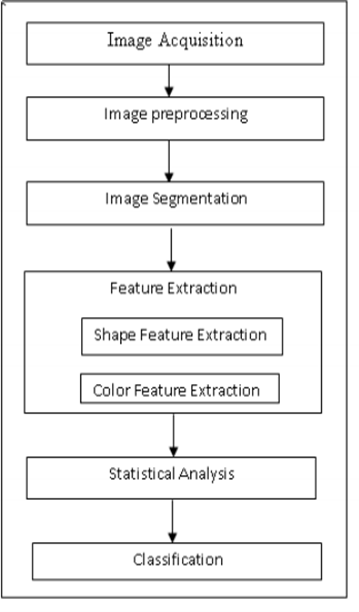

# Design Method

In the initial step, the RGB images of all the leaf samples were picked up. The step-by- step procedure of the proposed system:

•	RGB image acquisition;

•	Convert the input image from RGB to HSI format;

•	Masking the green-pixels;

•	Removal of masked green pixels;

•	Segment the components;

•	Obtain useful segments;

•	Evaluating feature parameters for classification;

•	Configuring SVM for disease detection.

# Analysis

• Color Transformation:

HSI (hue, saturation, intensity) color model is a popular color model because it is based on human perception. After transformation, only the H (hue) component of HSI colour space is taken into account since it provides us with the required information.

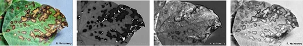

• Masking Green Pixels:

Green pixels are masked based on the specified threshold values, performed as: if green component of pixel intensity is less than previously calculated threshold value then RGB all components are assigned zero value for that pixel.

This is done as green colour pixel represent the healthy region of a leaf.

Masked pixel are removed – The pixels with RGB intensities as zero are completely removed.

• Segmentation:

The infected portion of the leaf is extracted by segmenting the diseased part with other similar coloured parts (say, a brown coloured branch of a leaf that may look like the disease) which have been considered in the masked out image, are filtered here.All further image processing is done over a region of interest (ROI) defined at this stage.

• Colour Co-occurrence:

Texture analysis method developed by spatial gray-level dependence matrices(SGDM), which consider the gray scale value of a pixel and finds other pixel with similar value to identify texture. The matrix measure probability that a particular gray valued pixel to have a distinct distance and orientation from a any point of particular gray-level. SGDM are generated for H - images and it’s function is represented as:-

P(i,j,d,theta)

• Classification:

From the previous results we analyze and evaluate the features like the area of the leaf, percentage(%) of the leaf infected, the perimeter of the leaf, etc., for all the leaf images, and pass it to the SVM classifier.

Minimum   distance   criteria   –   Classification   success   value   measured    using classification gain(G):

G (%) = Ccorr x 100

•	SVM (Support Vector Machines):

It involves analyzing the labelled training sets to predict unlabeled test set (future data). It finds relation between observations and labelled data sets. best vector is one with largest separation or margin between two classes.

• Dataset creation:

Samples of leaves with various diseases like early scorch, yellow spots, brown spots, late scorch, bacterial and fungal diseases are shown in figure below.

Bacterial Diseases in Rose & Beans leaf

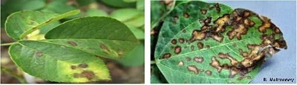

Sun burn-lemon leaf & Early scorch-banana

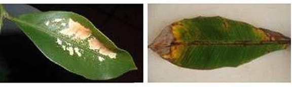

Late scorch-beans & Fungal-beans leaf

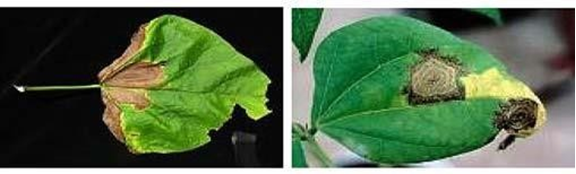

# Screenshots

Selectable menu & Description on cucumber plant

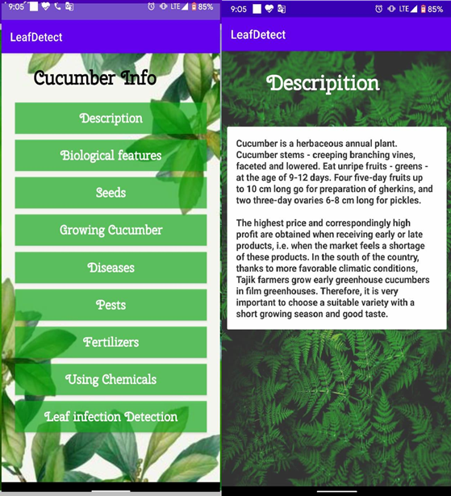

Biological features of cucumber & various seeds of cucumber crop

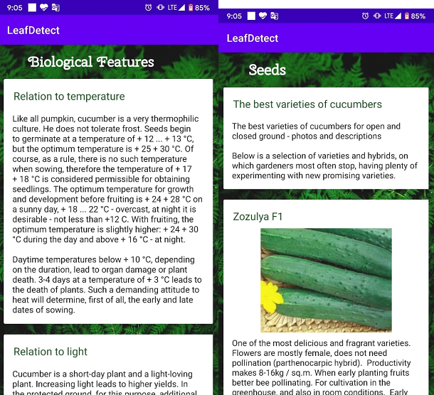

Directions of growing cucumber & various diseases commonly found on cucumber app

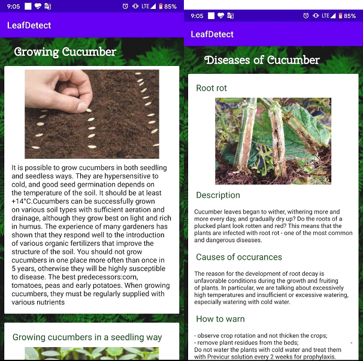

Pest control on cucumber & Fertilizers that can cure diseases on cucumber

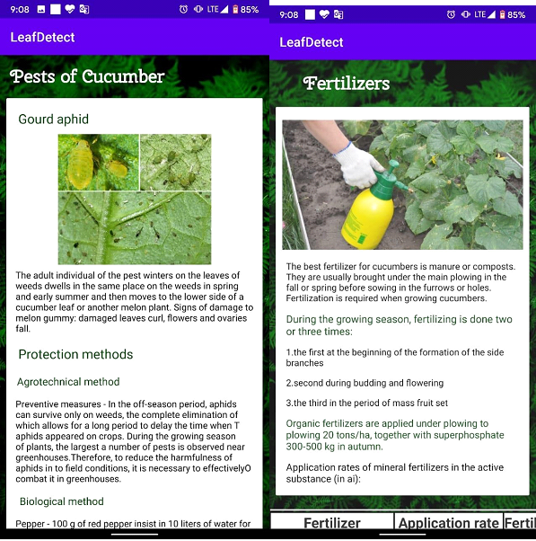

Organic Fertilizers to offer & Detection of leaf infection using image processing – in this page the selection of the leaf image is done

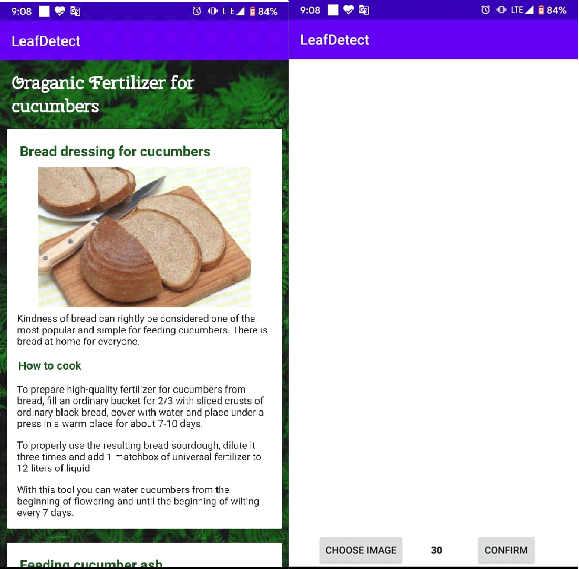

The image of a crop or leaf is selected and then sent for processing & The result of the infection is given here

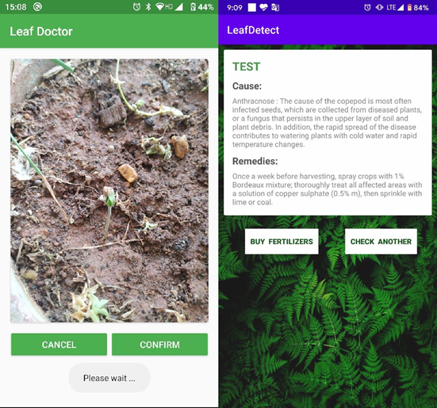

This is a shopping page for the purchase of the fertilizers & The checkout page after shopping of fertilizers

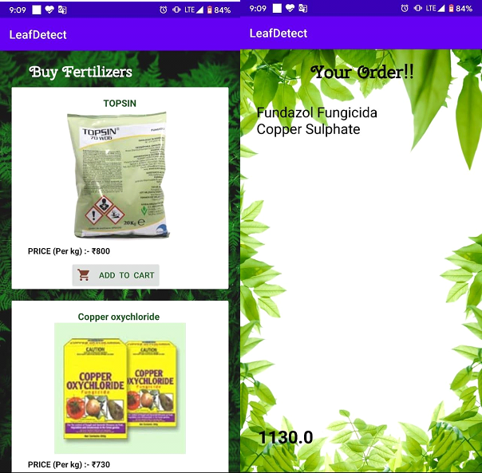

